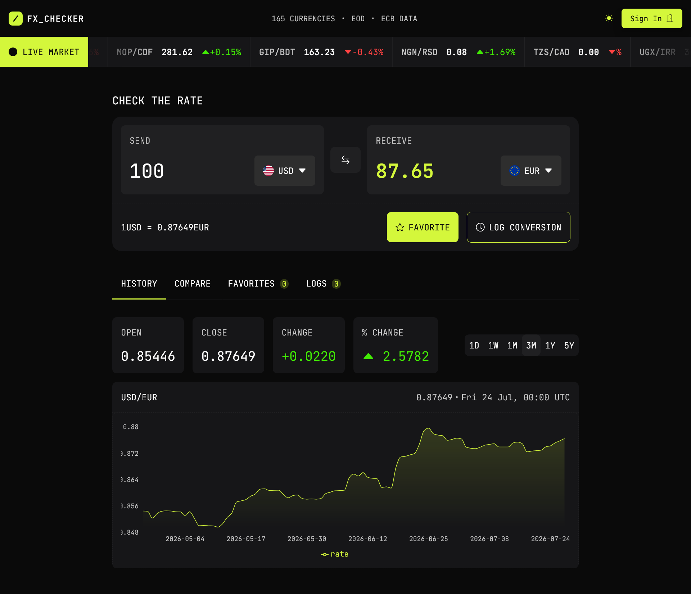

# Frontend Mentor - FX Checker solution

This is a solution to the [FX Checker challenge on Frontend Mentor](https://www.frontendmentor.io/challenges/foreign-exchange-currency-converter). Frontend Mentor challenges help you improve your coding skills by building realistic projects.

## Table of contents

- [Overview](#overview)
  - [The challenge](#the-challenge)
  - [Screenshot](#screenshot)
  - [Links](#links)
- [My process](#my-process)
  - [Built with](#built-with)
  - [Project Directory Structure](#project-directory-structure)
  - [What I learned](#what-i-learned)
  - [Continued development](#continued-development)
  - [Useful resources](#useful-resources)
  - [AI Collaboration](#ai-collaboration)
- [Author](#author)
- [Acknowledgments](#acknowledgments)

## Overview

### The challenge

Users should be able to:

#### Converter
- Enter an amount to send and see it convert in real time as they type
- Pick the "send" and "receive" currencies from a searchable currency picker
- See the live exchange rate for the active pair
- Swap the send and receive currencies with the swap button
- Favorite the active pair, and log a conversion to their history

#### Currency picker
- Search the full list of available currencies by code or name
- See currencies grouped into "Popular" and "Other currencies", each row showing the flag, code, and name
- See a check mark against the currently selected currency

#### Live markets ticker
- See a ticker of currency pairs, each with its current rate and 24-hour change
- Pause movement on hover and keyboard focus for accessible interaction

#### Rate history
- View a chart of the active pair's rate over time
- Switch chart ranges (1D, 1W, 1M, 3M, 1Y, 5Y)
- See open, last, absolute change, and percentage change for the selected range

#### Compare
- See send amount converted into multiple currencies simultaneously with reference rates
- Pin or unpin comparison rows to favorites without cross-feature domain coupling

#### Favorites
- See pinned pairs with live rates and 24-hour changes
- Load a pinned pair back into the converter by selecting its row
- Clear all favorites or unpin individual pairs

#### Conversion log
- View a log of conversions with relative timestamps, pairs, and send/receive amounts
- Delete individual log entries, clear all logs, or export history to CSV

#### Account & Authentication
- Manage user sessions via Login and Log Out cards
- Protect protected user actions (e.g., favoriting, clearing logs) at the component interaction boundary using `SignInInterceptor`. Unauthenticated interactions trigger an inline login modal without navigating away or losing active state (such as unsaved converter input).

#### UI & accessibility
- View the optimal layout for the interface depending on device screen size
- High-contrast hover and focus-visible states for all interactive elements
- Navigate the entire application using keyboard-only navigation (`Tab` / `Shift+Tab`)

### Screenshot



### Links

- Solution URL: [GitHub Repository](https://github.com/vickbk/fxchecker)
- Live Site URL: [Live Demo on Vercel](https://fxchecker-ten.vercel.app)

## My process

### Built with

- **Framework & Core**: [Next.js 16 (App Router)](https://nextjs.org/) with React 19 & TypeScript 6
- **Styling & Icons**: [Tailwind CSS v4](https://tailwindcss.com/) with PostCSS & [Bootstrap Icons](https://icons.getbootstrap.com/)
- **Database & ORM**: [Drizzle ORM](https://orm.drizzle.team/) with PostgreSQL (`pg`) & [Drizzle Kit](https://orm.drizzle.team/kit-docs/overview)
- **Authentication**: [NextAuth.js v5 (beta)](https://next-auth.js.org/)
- **Data Visualization**: [Recharts](https://recharts.org/) for rate history visualization
- **Validation**: [Zod](https://zod.dev/) for type-safe schema validation
- **Testing & Tooling**: [Vitest](https://vitest.dev/), [Playwright](https://playwright.dev/) for E2E testing, React Testing Library, MSW (Mock Service Worker), Happy DOM, and ESLint
- **Performance & Analytics**: [@vercel/speed-insights](https://vercel.com/docs/speed-insights)

### Project Directory Structure

```text
.
├── app/                         # Next.js App Router (pages & route composition)
├── features/                    # Domain-driven feature modules
│   ├── account/                 # Auth cards, SignInInterceptor & session logic
│   ├── compare/                 # Multi-currency rate comparison
│   ├── converter/               # Core converter module
│   ├── favorites/               # Pinned currency pairs & slot wrappers
│   ├── header/                  # Theme toggle & live market marquee
│   ├── history/                 # Historical charts & rate analytics
│   └── logs/                    # Audit logs & CSV export
├── infra/                       # Infrastructure setups, database clients (Drizzle/Postgres)
├── shared/                      # Shared UI primitives, design tokens, common hooks & utilities
└── tests/
    └── playwright/              # Centralized E2E test specs
```

### What I learned

#### 1. Accessible Infinite Marquee via `IntersectionObserver`

To satisfy WCAG 2.1 accessibility requirements without breaking continuous CSS marquee animations, off-screen duplicated items must not cause keyboard focus traps. I created the `useMarqueeVisibility` custom hook, which uses an `IntersectionObserver` scoped to the marquee container to track visible elements and dynamically toggle `tabIndex` and `aria-hidden` attributes:

```typescript
export function useMarqueeVisibility<
  C extends HTMLElement = HTMLDivElement,
  I extends HTMLElement = HTMLElement,
>() {
  const containerRef = useRef<C | null>(null);
  const [visibleKeys, setVisibleKeys] = useState<Set<string>>(new Set());
  const observerRef = useRef<IntersectionObserver | null>(null);

  useEffect(() => {
    const container = containerRef.current;
    if (!container) return;

    observerRef.current = new IntersectionObserver(
      (entries) => {
        setVisibleKeys((prev) => {
          const next = new Set(prev);
          let changed = false;

          for (const entry of entries) {
            const key = entry.target.getAttribute("data-marquee-key");
            if (!key) continue;

            if (entry.isIntersecting) {
              if (!next.has(key)) {
                next.add(key);
                changed = true;
              }
            } else {
              if (next.has(key)) {
                next.delete(key);
                changed = true;
              }
            }
          }

          return changed ? next : prev;
        });
      },
      {
        root: container,
        threshold: 0.05,
      },
    );

    return () => {
      observerRef.current?.disconnect();
    };
  }, []);

  return { containerRef, registerItem, isItemVisible };
}
```

#### 2. Architectural Decoupling with Inversion of Control Slot Patterns

To maintain strict domain isolation under `features/*` (e.g. avoiding direct imports from `features/favorites` inside `features/compare`), I implemented an Inversion of Control (IoC) component slot pattern (`FavoriteToggleWrapper`). The domain component accepts generic slot props, and the Next.js page composition layer handles the injection:

```tsx
// features/favorites/components/FavoriteToggleWrapper.tsx — Reusable Slot Component
export const FavoriteToggleWrapper = async ({
  base,
  quote,
  isFavorite,
  SignInInterceptor,
}: {
  base: string;
  quote: string;
  isFavorite?: boolean;
  SignInInterceptor: SignInInterceptor;
}) => {
  const action = toggleFavorite.bind(null, { base, quote });

  isFavorite =
    isFavorite ?? !!(await getFavorites())?.includes(`${base}-${quote}`);

  return (
    <form action={action as () => void}>
      <FavoriteToggleSubmit {...{ isFavorite, SignInInterceptor }} />
    </form>
  );
};

// app/(main)/compare/page.tsx — Page Route Composition Layer
import { MainCompare } from "@/features/compare";
import { FavoriteToggleWrapper } from "@/features/favorites";

export default function ComparePage() {
  return <MainCompare FavoriteSlot={FavoriteToggleWrapper} />;
}
```

#### 3. Interaction-Level Auth Interception via `SignInInterceptor`

Wrapping sensitive user triggers with `SignInInterceptor` catches protected user interactions before execution. Unauthenticated users are presented with an inline sign-in trigger/modal (`SignInTrigger`) without losing current form inputs, converter selections, or navigating away from their active context:

```tsx
// features/account/modules/interceptor/components/SignInInterceptor.tsx
export const SignInInterceptor = ({
  onClick,
  children,
  type = "button",
  description,
  ...props
}: SignInTriggerProps) => {
  const { data: session, status } = useSession();
  const [isPending, startTransition] = useTransition();

  const isLoading = status === "loading";
  const isAuthenticated = !!session?.user;

  const handleClick = (e: MouseEvent<HTMLButtonElement>) => {
    if (isPending) return;
    setTimeout(() => {
      startTransition(async () => await onClick?.(e));
    }, 0);
  };

  if (isLoading) {
    return (
      <button
        type="button"
        disabled
        {...props}
        className={props.className + " opacity-50 cursor-wait"}
      >
        {children}
      </button>
    );
  }

  if (!isAuthenticated) {
    return (
      <SignInTrigger {...{ ...props, description }}>{children}</SignInTrigger>
    );
  }

  return (
    <button type={type} {...props} onClick={handleClick} disabled={isPending}>
      {children}
    </button>
  );
};
```

#### 4. Feature Co-located E2E Story Specs & Test Orchestration

Instead of isolating tests in a monolithic root directory, I co-located E2E specs, unit tests, and component logic within their respective domain folders (`features/*`). Centralized Playwright E2E test specs in `tests/playwright/` import re-usable user interaction stories directly from each feature's `__testing__` module:

```typescript
// tests/playwright/converter.spec.ts — Centralized E2E orchestration
import { test } from "@playwright/test";
import { shouldSwapBaseAndQuoteCurrencyAndCovert } from "@/features/converter/__testing__/stories";

test("should swap base and quote currency and do the conversion", async ({ page }) => {
  await page.goto("/convert");
  await shouldSwapBaseAndQuoteCurrencyAndCovert(page);
});
```

### Continued development

- **Offline Rate Caching & PWA Support**: Implementing a progressive service worker strategy for offline currency rate lookups and fallback conversions.
- **Real-Time WebSocket Feed**: Transitioning rate updates from interval polling to a streaming WebSocket connection for live ticker updates.
- **Enhanced Financial Analytics**: Introducing multi-currency trend forecasting and custom rate threshold notifications in the Rate History chart.

### Useful resources

- [Next.js App Router Documentation](https://nextjs.org/docs) - Crucial reference for Server Components, Server Actions, and page-level composition.
- [W3C WAI-ARIA Authoring Practices Guide](https://www.w3.org/WAI/ARIA/apg/) - Best practices for accessible dynamic UIs and keyboard navigation management.
- [Drizzle ORM Documentation](https://orm.drizzle.team/) - Clear guide for type-safe schema definitions and PostgreSQL migration setups.

### AI Collaboration

AI assistance was integrated across the project lifecycle for task planning, architectural enforcement, and accessibility engineering:

- **Architectural Decoupling**: Applied Inversion of Control (IoC) component slot patterns to strictly decouple feature domains (`features/compare`, `features/favorites`, `features/converter`), preventing cross-domain import leaks.
- **WCAG 2.1 Accessibility Engineering**: Designed the `useMarqueeVisibility` hook using Intersection Observer APIs to ensure looping market tickers satisfy keyboard navigation (`Tab` / `Shift+Tab`) standards without disabling marquee movement.
- **Task Normalization & E2E Testing**: Used AI to organize modular task lists (`tasks.md`) for every feature domain and generate co-located Playwright E2E story specifications.

## Author

- Website - [Victor](https://github.com/vickbk)
- Frontend Mentor - [@vickbk](https://www.frontendmentor.io/profile/vickbk)
- GitHub - [@vickbk](https://github.com/vickbk)

## Acknowledgments

Special thanks to Frontend Mentor for providing the realistic project brief and design specs, and the open-source community behind Next.js, React, Tailwind CSS, and Drizzle ORM.
